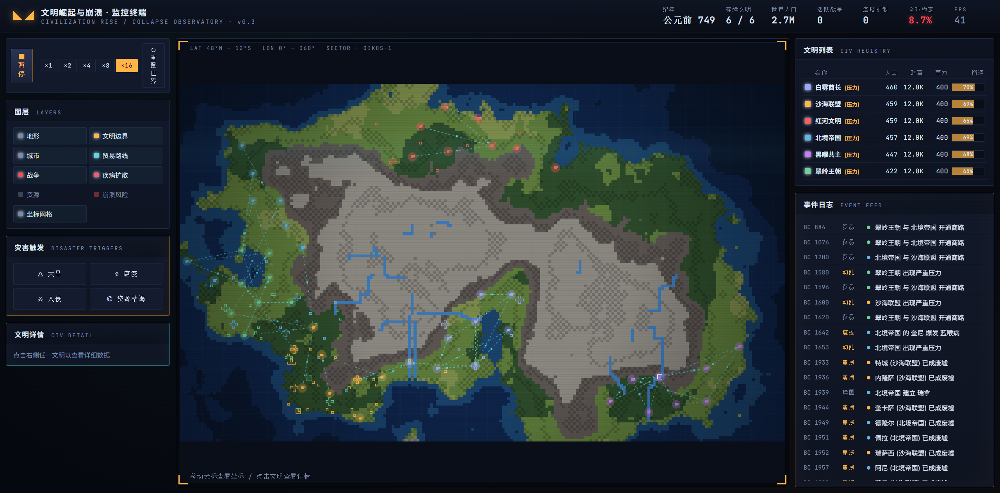
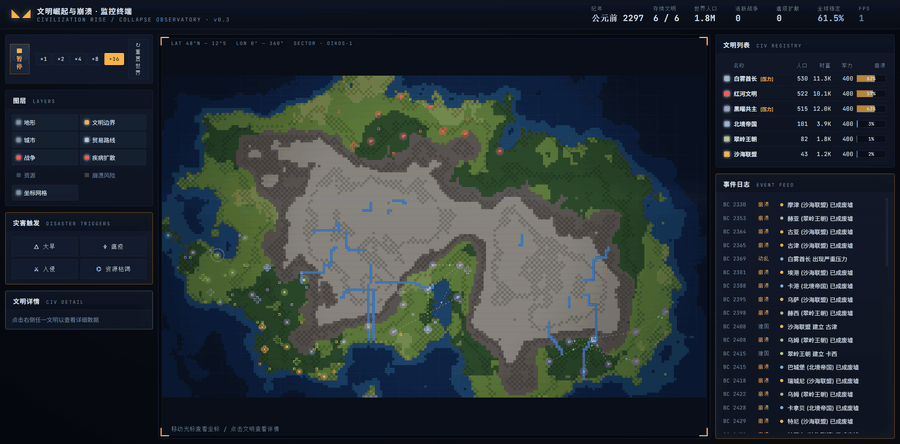

# 文明崛起与崩溃 · 监控终端

中文 · [English](./README.md)

[](https://civilization-rise-and-collapse.vercel.app/)
[](https://github.com/wfxu/civilization-rise-and-collapse/commits/main)
[](./LICENSE)

博物馆级别的「战略指挥中心」风格实时模拟器：在程序生成的大陆上，多个文明从聚落、扩张、贸易、战争、瘟疫到崩溃的完整生命周期。所有视觉元素纯代码生成，不使用任何图片、贴图、视频或外部地图。

**在线演示：** https://civilization-rise-and-collapse.vercel.app/
**源码：** https://github.com/wfxu/civilization-rise-and-collapse





---

## 技术栈

- React 18 + TypeScript + HTML Canvas
- Babel standalone（浏览器内编译 TS/TSX）—— **无需构建步骤**
- 静态部署（Vercel / GitHub Pages / 任何静态托管）

## 本地运行

通过 HTTP 打开 `index.html`（浏览器不允许 `file://` 加载模块脚本）：

```bash
npx serve .
# 或
python -m http.server 8000
```

## 项目结构

```
utils/        类型、随机数、value-noise
data/         调色板、文明模板、城名生成
simulation/   world（地形 / 河流）, engine（文明 / 城市 / 贸易 / 战争 / 疾病 / 崩溃）
rendering/    Canvas 渲染（等高线、扫描线、光晕、脉动环）
components/   App、Panels
index.html    入口，按依赖顺序加载模块
styles.css
```

## 功能

- 程序化地图：双中心大陆 + value-noise + 河流溯流，含海洋 / 海岸 / 平原 / 草原 / 森林 / 沙漠 / 山脉 / 苔原
- 6 个具有不同意识形态的文明
- 城市：食物 / 人口 / 财富 / 疾病 / 暴乱；密度过高自发瘟疫；崩溃后变成废墟
- 贸易路线：动画商队、传播疾病、战争中断
- 战争：宣战、前线扰动、城市易主、议和
- 疾病：脉动环可视化，按距离 + 贸易传播
- 崩溃风险 = 不稳 + 战疲 + 疫情 + 气候 + 缺粮，分 4 阶段；文明可分裂或消失
- 灾害触发：大旱 / 瘟疫 / 入侵 / 资源枯竭
- 9 个图层可切换，×1–×16 速度，世界重置
- 事件日志按严重度着色

## 由来

整套项目由 [Claude Design](https://claude.ai/design) 通过一段中文提示词端到端生成 —— 见 [PROMPT.md](./PROMPT.md)。

## 许可证

MIT —— 见 [LICENSE](./LICENSE)。
